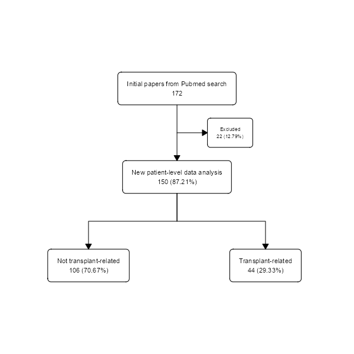
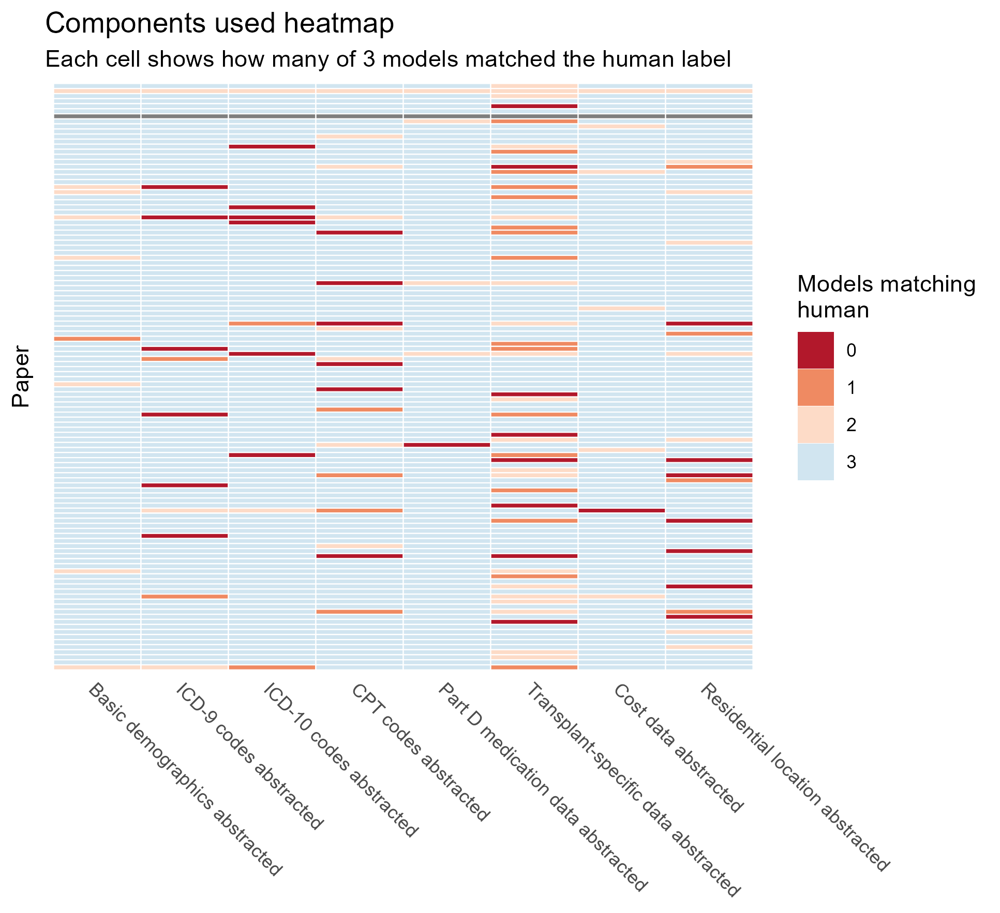
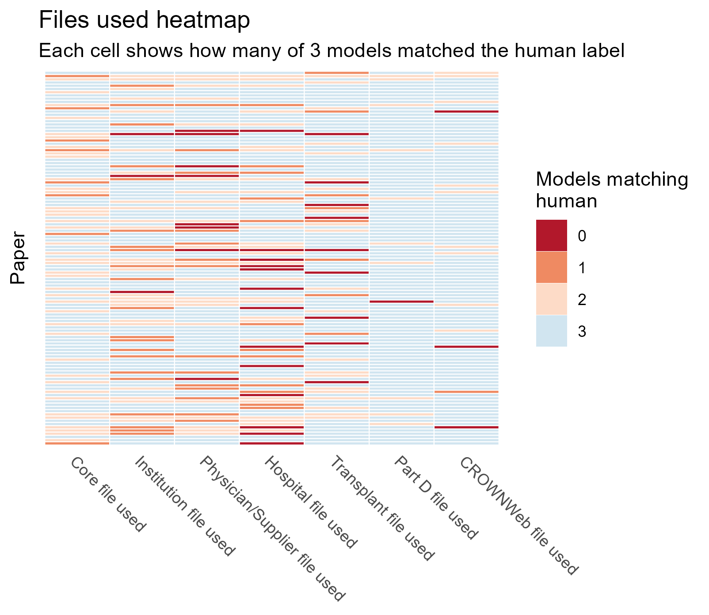
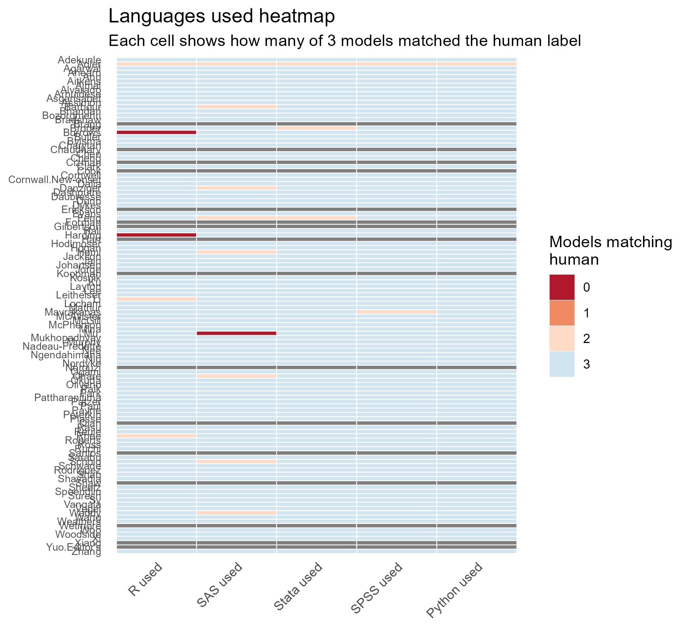
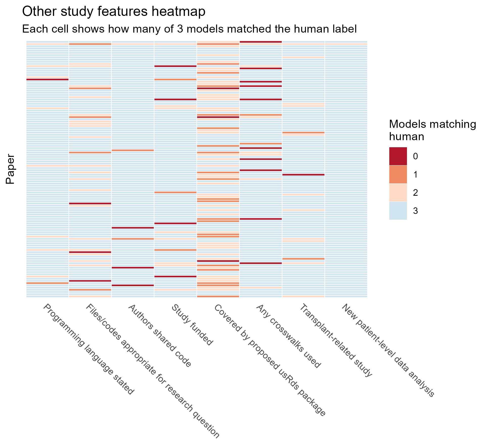

```{r, include=FALSE}


#This code prepares the .qmd environment for analysis

new_analysis_gt<-readRDS("../Kidney conference abstract/new_analysis_gt.rds")
transplant_gt<-readRDS("../Kidney conference abstract/transplant_gt.rds")
timing_gt<-readRDS("../Kidney conference abstract/timing_gt.rds")
kappa_table_full<-readRDS("../Kidney conference abstract/kappa_table_full.rds")
kappa_legend_gt<-readRDS("../Kidney conference abstract/kappa_legend_gt.rds")
breakdown_gt_full<-readRDS("../Kidney conference abstract/breakdown_gt_full.rds")


source("../R/Analysis setup.R")


```


## Study selection

The flowchart below summarizes how papers were identified, screened, and included in the manual review dataset. This manually reviewed sample serves as the reference set for the descriptive results presented on this page.



## Descriptive performance

The table below shows the wall-clock time required for each model to process the full dataset (not limited to transplant).

```{r, echo=FALSE}

timing_gt

```

```{r, echo=FALSE}

new_analysis_gt

```

```{r, echo=FALSE}

transplant_gt

```


```{r, echo=FALSE}

breakdown_gt_full

```


## Heatmaps








## Kappa analysis

```{r, echo=FALSE}

kappa_table_full

```

```{r, echo=FALSE}

kappa_legend_gt

```
