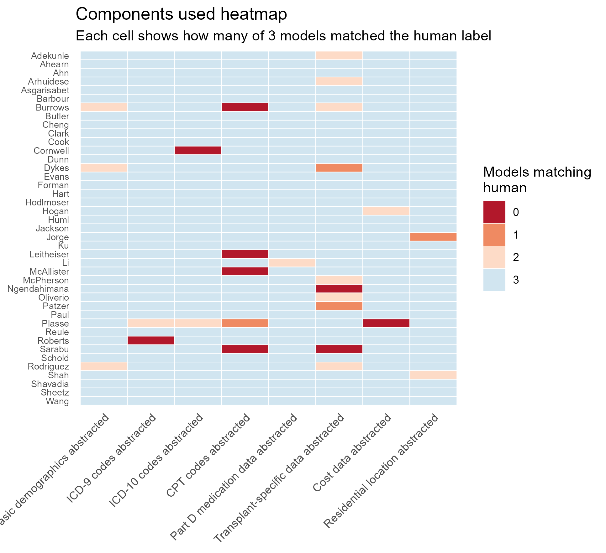
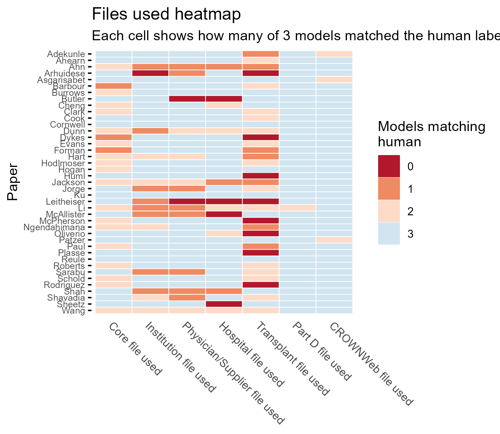
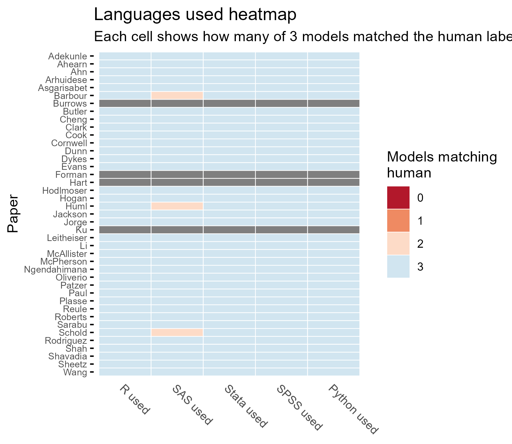
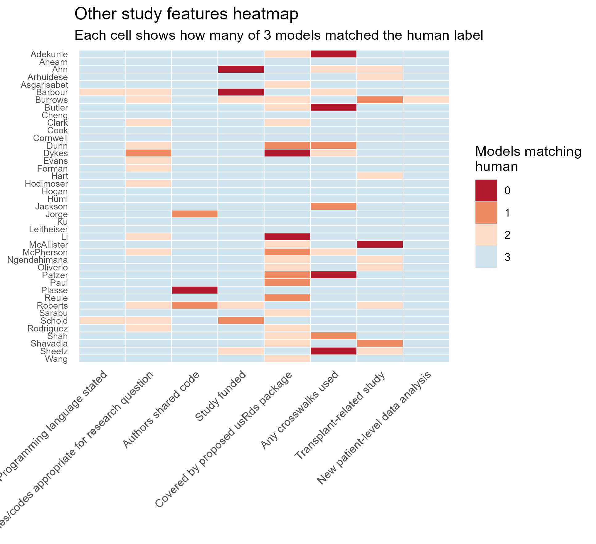

```{r, include=FALSE}


#This code prepares the .qmd environment for analysis


timing_table_atc<-readRDS("../ATC 2026 abstract/timing_table_atc.rds")
kappa_table_atc<-readRDS("../ATC 2026 abstract/kappa_table_atc.rds")
kappa_legend_gt<-readRDS("../ATC 2026 abstract/kappa_legend_gt.rds")
breakdown_gt_atc<-readRDS("../ATC 2026 abstract/breakdown_gt_atc.rds")


source("../R/Analysis setup.R")


```


## Study selection

The flowchart below summarizes how papers were identified, screened, and included in the manual review dataset. This manually reviewed sample serves as the reference set for the descriptive results presented on this page.


## Descriptive performance

The table below shows the wall-clock time required for each model to process the full dataset (not limited to transplant).

```{r, echo=FALSE}

timing_table_atc

```

## Comparison of human and LLM answers

The next table summarizes how often each model matched the human-reviewed reference standard for selected study characteristics. These descriptive results provide an initial overview of performance before moving to the more detailed visual and κ-based summaries below.

```{r, echo=FALSE}

breakdown_gt_atc

```

Taken together, these results suggest that model performance varied across extraction tasks. Broad study features were often identified accurately, whereas more specific methodological details were less consistently recovered from article PDFs.

## Heatmaps

The following heatmaps provide a more detailed view of extraction performance across groups of related variables. Rather than emphasizing one variable at a time, they highlight patterns within domains of abstraction and make it easier to identify where model performance was more or less reliable.

### Analytic components

This heatmap summarizes model performance for major analytic and study-design components. These variables reflect whether the models correctly identified core features of the study methods and analytic approach.




### USRDS files and data components

This heatmap focuses on variables related to which USRDS files or data components were used in each paper. These details are often reported inconsistently in manuscripts, making them a particularly important test of structured PDF extraction.



### Programming languages

This heatmap summarizes identification of programming languages used in the included studies. Programming languages were frequently omitted, briefly mentioned, or described indirectly, so this domain helps illustrate model performance when methodological reporting is sparse.




### Other study features

The final heatmap displays remaining variables that did not fit neatly into the earlier categories. Together, the four heatmaps provide a fuller picture of where model extraction aligned well with human review and where important gaps remained.



## κ analysis

the table below presents Cohen's κ comparing each model with the human-reviewed reference standard across the included variables. κ provides a stricter measure of agreement and is especially useful when some categories are much more common than others.

```{r, echo=FALSE}

kappa_table_atc

```

```{r, echo=FALSE}

kappa_legend_gt

```

Overall, the κ results support a mixed-performance view of LLM-based extraction. Some variables showed strong agreement with manual review, suggesting that LLMs may be useful for accelerating abstraction or pre-populating structured review fields. Other variables showed weaker agreement, indicating that human validation remains important when extracting detailed technical or methodological information from PDFs.

In practice, these findings support using LLMs as an aid to literature review.  Further work should explore how improved LLM prompts and use of more advanced models can improve consistency and accuracy of LLM extraction.